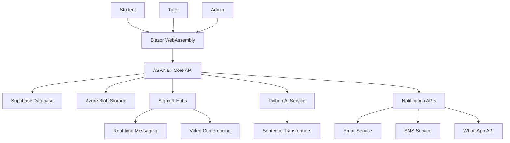
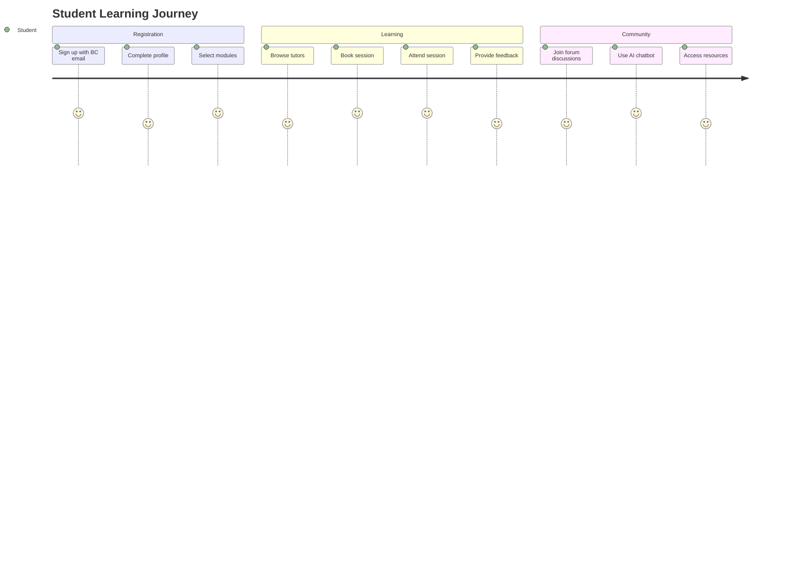

<div align="center">

# 🎓 TUTORLY™

### *Empowering Belgium Campus Students Through Peer-Powered Learning*

[](https://dotnet.microsoft.com/download)
[](https://dotnet.microsoft.com/apps/aspnet/web-apps/blazor)
[](https://supabase.com/)
[](https://azure.microsoft.com/en-us/services/storage/)

[](https://github.com/Nick2711/TUTORLY-Peer-Powered-Learning-Platform/stargazers)
[](https://github.com/Nick2711/TUTORLY-Peer-Powered-Learning-Platform/network)
[](https://github.com/Nick2711/TUTORLY-Peer-Powered-Learning-Platform/issues)
[](https://github.com/Nick2711/TUTORLY-Peer-Powered-Learning-Platform/blob/main/LICENSE)

---

**An innovative peer-to-peer tutoring platform designed exclusively for Belgium Campus students**

*Connecting students with peer tutors for BCom, BIT, and Diploma modules*

---

</div>

## 📋 Table of Contents

- [🌟 Overview](#-overview)
- [✨ Features](#-features)
- [🎯 Target Audience](#-target-audience)
- [🏗️ Architecture](#️-architecture)
- [🚀 Quick Start](#-quick-start)
- [📱 User Experience](#-user-experience)
- [🏆 Project Recognition](#-project-recognition)
- [🤝 Contributing](#-contributing)
- [👥 Team](#-team)

---

## 🌟 Overview

<div align="center">


</div>

**CampusLearn™** is a cutting-edge peer-to-peer tutoring platform that revolutionizes how Belgium Campus students access academic support. Built as part of our Software Engineering capstone project, this platform bridges the gap between traditional lectures and personalized learning through intelligent student-tutor matching.

### 🎯 **Our Mission**
To create a collaborative learning ecosystem where Belgium Campus students can easily connect with peer tutors, access AI-powered assistance, and participate in anonymous academic discussions—all within a single, intuitive platform.

---

## ✨ Features

### 🎓 **For Students**

<table>
<tr>
<td width="50%">

#### 🔐 **Smart Registration**
- Exclusive `@belgiumcampus.ac.za` email verification
- Secure profile creation with academic preferences
- Module-specific topic subscriptions

#### 🤖 **AI Chatbot Assistant**
- 24/7 intelligent academic support
- Instant answers to FAQs and study queries

#### 💬 **Anonymous Forum**
- Judgment-free academic discussions
- Trending topics and upvoting system
- Collaborative knowledge sharing

</td>
<td width="50%">

#### 📚 **Resource Access**
- Download learning materials
- Access videos, PDFs, and interactive content
- Mobile-friendly multimedia support

#### 📅 **Session Management**
- Easy booking with peer tutors
- Calendar integration
- Real-time session notifications

#### ⭐ **Feedback System**
- Rate tutoring sessions
- Review tutor performance
- Build reputation system

</td>
</tr>
</table>

### 👨‍🏫 **For Peer Tutors**

<table>
<tr>
<td width="50%">

#### 📝 **Topic Management**
- Create and manage academic topics
- Module-specific expertise areas
- Resource upload and organization

#### 🔔 **Smart Notifications**
- Real-time alerts for new queries
- Email and in-app notifications
- Priority-based notification system

#### 📊 **Analytics Dashboard**
- Session performance metrics
- Student feedback tracking
- Availability management

</td>
<td width="50%">

#### 🎯 **Module-Specific Access**
- Respond only to assigned modules
- Expertise-based matching
- Quality assurance through reviews

#### 💼 **Professional Development**
- Teaching experience opportunities
- Communication skill enhancement
- Leadership and mentoring skills

#### 🌟 **Recognition System**
- Build teaching reputation
- Earn badges and achievements
- Community recognition

</td>
</tr>
</table>

---

## 🎯 Target Audience

<div align="center">

| **Belgium Campus Students** | **Peer Tutors** | **Administrators** |
|:---:|:---:|:---:|
| 🎓 Seeking academic support | 👨‍🏫 Providing peer assistance | ⚙️ Platform management |
| 📚 BCom, BIT, Diploma modules | 🎯 Module-specific expertise | 📊 Analytics and oversight |
| 💡 Collaborative learning | 🌟 Skill development | 🔧 System maintenance |

</div>

---

## 🏗️ Architecture

<div align="center">



</div>

### 🛠️ **Technology Stack**

<table>
<tr>
<td width="33%">

#### **Frontend**
- **Blazor WebAssembly** (.NET 8.0)
- **Modern UI Components**
- **Responsive Design**
- **Real-time Updates**

</td>
<td width="33%">

#### **Backend**
- **ASP.NET Core Web API**
- **SignalR Real-time Communication**
- **JWT Authentication**
- **RESTful API Design**

</td>
<td width="33%">

#### **Services**
- **Supabase Database**
- **Azure Blob Storage**
- **Python AI Integration**
- **Multi-channel Notifications**

</td>
</tr>
</table>

---

## 🚀 Quick Start

### 📋 **Prerequisites**

```bash
# Required Software
✅ .NET 8.0 SDK
✅ Python 3.8+
✅ Supabase Account
✅ Azure Storage Account
```

### ⚡ **Installation**

<details>
<summary><b>🔧 Step-by-Step Setup</b></summary>

1. **Clone the Repository**
   ```bash
   git clone https://github.com/Nick2711/TUTORLY-Peer-Powered-Learning-Platform.git
   cd CampusLearn
   ```

2. **Configure Environment**
   ```bash
   # Copy configuration template
   cp Tutorly/Server/appsettings.json Tutorly/Server/appsettings.Development.json
   
   # Update with your credentials
   # - Supabase URL and API keys
   # - Azure Blob Storage connection string
   # - SMTP configuration
   ```

3. **Install Dependencies**
   ```bash
   # Python AI service
   pip install -r requirements.txt
   
   # .NET dependencies
   dotnet restore
   ```

4. **Start Services**
   ```bash
   # Terminal 1: AI Embedding Service
   start_embedding_api_auto.bat
   
   # Terminal 2: Backend API
   cd Tutorly/Server && dotnet run
   
   # Terminal 3: Frontend
   cd Tutorly/Client && dotnet run
   ```

5. **Access Platform**
   - 🌐 **Frontend**: `https://localhost:7085`
   - 🔌 **API**: `https://localhost:7085`

</details>

---

## 📱 User Experience

### 🎨 **Platform Screenshots**

<div align="center">

| **Student Dashboard** | **Tutor Interface** | **AI Chatbot** |
|:---:|:---:|:---:|


</div>

### 🔄 **User Journey**



---

## 🏆 Project Recognition

<div align="center">

### 🏅 **Software Engineering Capstone Project**

**Belgium Campus ITversity**

</div>

This project was developed as part of the **Software Engineering curriculum** at Belgium Campus, with the opportunity for the **best-developed system** to be selected for official hosting and deployment.

### 🎁 **Winning Team Benefits**

<table>
<tr>
<td width="50%">

#### 🏢 **Official Support**
- **Server hosting** provided by Belgium Campus
- **Technical support** for deployment
- **Financial backing** for maintenance

#### 🌟 **Recognition**
- **Sponsorship** opportunities
- **Platform recognition** on BC websites
- **Academic achievement** acknowledgment

</td>
<td width="50%">

#### 🚀 **Development Opportunities**
- **Continued development** funding
- **Real-world deployment** experience
- **Industry connections** and networking

#### 📈 **Impact**
- **Hundreds of students** will benefit
- **Live platform** serving the community
- **Legacy project** for future students

</td>
</tr>
</table>

---

## 👥 Development Team

<div align="center">

### 🎓 **Meet the CampusLearn™ Development Team**

*Four passionate Software Engineering students from Belgium Campus ITversity*

</div>

<table>
<tr>
<td width="25%" align="center">

### 👩‍💼 **Anouk van Alphen**
**Team Lead & Project Manager**


**Roles:**
- 🎯 Project Manager & Scrum Master
- 🏗️ Back-End Developer
- 🏛️ System Architect
- 🧪 Tester

**GitHub:** [@AnoukvanAlphen](https://github.com/AnoukvanAlphen/AnoukvanAlphen)

*Passionate software engineering student with growing interest in Cloud computing and networking. Thrives in team environments where collaboration, creativity, and ethical leadership take center stage.*

</td>
<td width="25%" align="center">

### 👨‍💻 **Nicholas Kelly**
**Team Lead & Lead Back-End Developer**


**Roles:**
- 🚀 Lead Back-End Developer
- 🏛️ System Architect
- 🔧 Integration Testing
- ⚙️ DevOps

**GitHub:** [@Nick2711](https://github.com/Nick2711/Nick2711)

*Final-year Software Engineering student at Belgium Campus ITversity. Thrives in team environments. Passionate about building innovative solutions and contributing to impactful projects.*

</td>
<td width="25%" align="center">

### 👨‍💻 **Viljoen Steenkamp**
**Database Analyst & Front-End Developer**


**Roles:**
- 🗄️ Database Analyst
- 🏗️ Database Architect
- 🎨 Front-End Developer

**GitHub:** [@Cimannin](https://github.com/Cimannin)

*Dedicated Software Engineering student focused on creating robust database solutions and intuitive user interfaces.Passionate about building innovative solutions.*

</td>
<td width="25%" align="center">

### 👨‍🎨 **Matthew Smith**
**Lead Front-End Developer & UI/UX Designer**


**Roles:**
- 🎨 Lead Front-End Developer
- 🖌️ UI/UX Designer

**GitHub:** [@mattys1908](https://github.com/mattys1908/mattys1908)

*Final Year Software Engineer skilled in designing, developing, and deploying robust solutions. Builds full-stack applications with a focus on clean, maintainable code.*

</td>
</tr>
</table>

### 🌟 **Team Collaboration**

Our team worked collaboratively using **Agile methodologies** with **Scrum** practices, ensuring efficient project delivery and continuous improvement. Each team member brought unique expertise to create a comprehensive tutoring platform that serves the Belgium Campus community.

**Key Achievements:**
- ✅ **Full-stack development** using modern .NET technologies
- ✅ **Real-time communication** implementation with SignalR
- ✅ **AI integration** for intelligent tutoring assistance
- ✅ **Comprehensive testing** and quality assurance
- ✅ **Professional UI/UX design** for optimal user experience

---

## 🤝 Contributing

<div align="center">

### 🌟 **We Welcome Contributions!**

*Help us make CampusLearn™ even better for Belgium Campus students*

</div>

### 📝 **How to Contribute**

1. **🍴 Fork the Repository**
   ```bash
   # Click the Fork button on GitHub
   ```

2. **🌿 Create Feature Branch**
   ```bash
   git checkout -b feature/amazing-feature
   ```

3. **💻 Make Changes**
   ```bash
   # Follow C# coding conventions
   # Write comprehensive tests
   # Update documentation
   ```

4. **📤 Submit Pull Request**
   ```bash
   git commit -m "Add amazing feature"
   git push origin feature/amazing-feature
   ```

### 📋 **Development Guidelines**

- ✅ Follow **C# coding conventions** and .NET best practices
- ✅ Write **comprehensive unit tests** for new features
- ✅ Update **API documentation** for changes
- ✅ Ensure **all tests pass** before submitting PR
- ✅ Maintain focus on **Belgium Campus academic requirements**

---


## 👥 Team

<div align="center">

### 🎓 **Belgium Campus SEN381 Students**

<table>
<tr>
<td align="center">

#### 🏫 **Institution**
**Belgium Campus ITversity**

#### 📚 **Program**
**Software Engineering Capstone Project**

#### 🎯 **Mission**
*Empowering student success through peer-powered learning*

</td>
</tr>
</table>

---

## 📞 Support & Contact

<div align="center">

### 💬 **Get Help**

| **Support Channel** | **Contact** |
|:---:|:---:|
| 🐛 **Bug Reports** | [GitHub Issues](https://github.com/Nick2711/TUTORLY-Peer-Powered-Learning-Platform/issues) |
| 💡 **Feature Requests** | [GitHub Discussions](https://github.com/Nick2711/TUTORLY-Peer-Powered-Learning-Platform/discussions) |
| 📧 **General Support** | [TutorlyBC@gmail.com](mailto:TutorlyBC@gmail.com) |
| 🏫 **Academic Inquiries** | Belgium Campus ITversity |

</div>

---

<div align="center">

## 🌟 **Built with ❤️ for Belgium Campus Students**

### *Empowering student success through peer-powered learning*

---

**⭐ Star this repository if you find it helpful!**

[](https://github.com/Nick2711/TUTORLY-Peer-Powered-Learning-Platform/stargazers)
[](https://github.com/Nick2711/TUTORLY-Peer-Powered-Learning-Platform/network)

</div>
